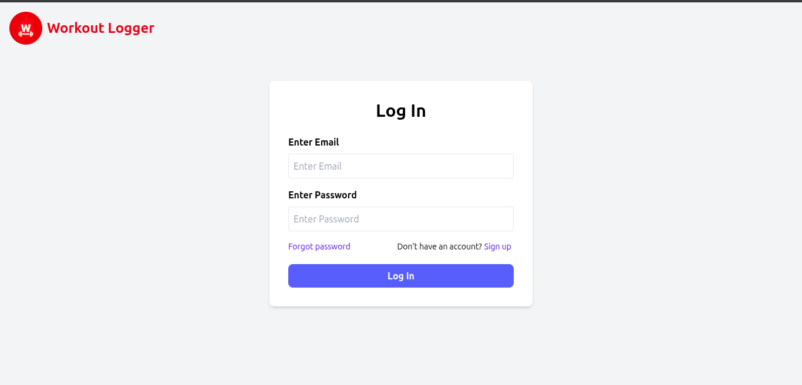
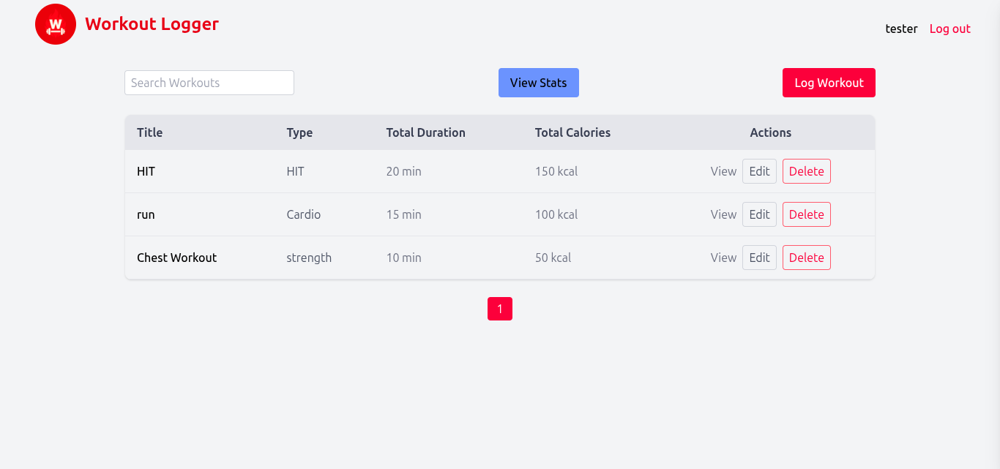
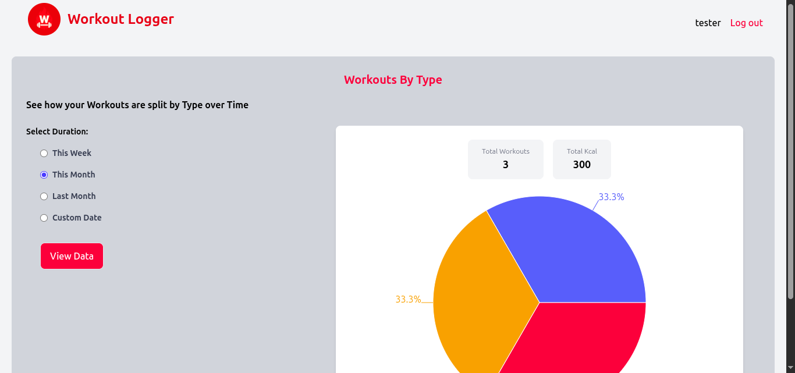
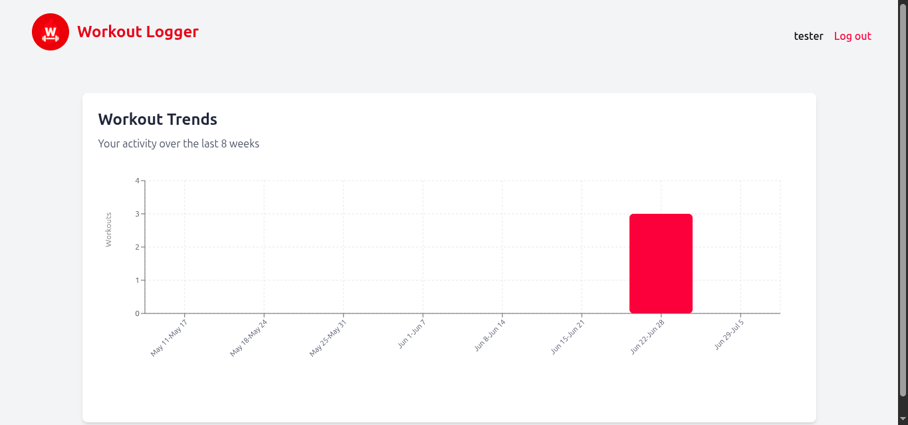
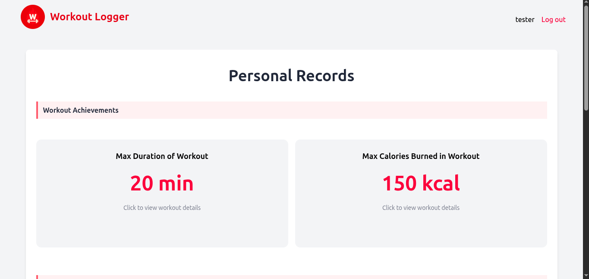
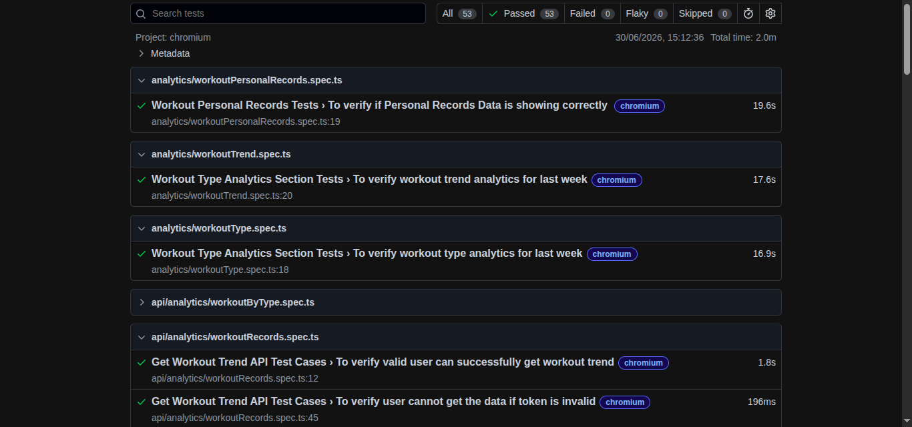
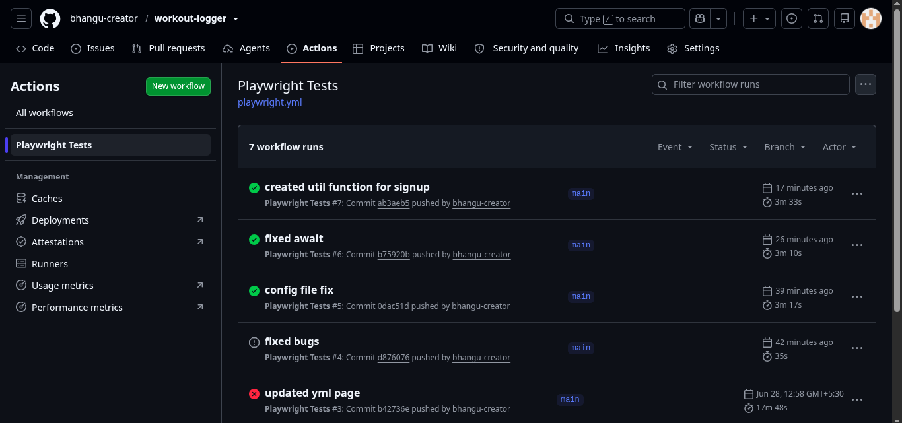

# 🏋️ Workout Logger - Full Stack MERN Application & Playwright Automation Framework

> A production-ready MERN fitness tracking application with a professional Playwright + TypeScript automation framework covering UI, API, and CI/CD workflows.

[](https://github.com/bhangu-creator/workout-logger/actions/workflows/playwright.yml)

## 🔗 Live Demo

**Application:** https://workout-logger-three.vercel.app/

**Backend API:** https://workout-logger-backend-wyt7.onrender.com/

---

## 🚀 Tech Stack

### Frontend

* React
* React Router
* Tailwind CSS
* Axios
* Recharts

### Backend

* Node.js
* Express.js
* MongoDB Atlas
* Mongoose
* JWT Authentication
* bcrypt
* Nodemailer

### Automation

* Playwright
* TypeScript
* Page Object Model (POM)
* API Testing
* GitHub Actions
* HTML Reports

---

## 📸 Screenshots

## login page


## dashboard


## analytics by type


## analytics by trend


## analytics by personal record


## playwright report


## github action green check


> *(Add screenshots here)*

* Application Home Page
* Dashboard
* Analytics
* Playwright HTML Report
* GitHub Actions Successful Pipeline

Demo Video

https://youtu.be/z_NlMguU3j4

---

# 📖 Project Overview

Workout Logger is a full-stack fitness tracking application that enables users to record workouts, analyze fitness progress, and visualize workout statistics.

Alongside the application, this repository contains a production-style Playwright automation framework built using TypeScript following industry-standard automation practices.

This project demonstrates both software development and software quality engineering.

---

# ✨ Application Features

## Authentication

* User Signup
* User Login
* JWT Authentication
* Forgot Password
* Reset Password via Email
* Protected Routes

## Workout Management

* Create Workouts
* Edit Workouts
* Delete Workouts
* Search Workouts
* Pagination
* Multiple Exercises per Workout

## Analytics

### Workout Distribution

* Pie Chart
* Workout Type Breakdown
* Calories by Workout Type

### Weekly Trends

* Eight Week Activity Trends
* Calories Burned
* Workout Count

### Personal Records

* Longest Workout
* Highest Calories Burned
* Current Workout Streak
* Longest Workout Streak
* Lifetime Statistics

---

# 🧪 Playwright Automation Framework

The repository includes a professional Playwright automation framework developed using TypeScript and Page Object Model architecture.

## Framework Features

* TypeScript
* Page Object Model (POM)
* UI Automation
* API Automation
* Reusable Test Data
* Environment Configuration
* Constants Management
* GitHub Actions CI/CD
* HTML Reports
* Trace Viewer Support
* Cross Browser Ready

---

# 📊 Test Coverage

Current automated coverage includes:

### UI Automation

* Signup Page
* Login Page
* Authentication Flows
* Navigation
* Form Validation
* UI Smoke Tests

### API Automation

Authentication APIs

* Signup
* Login
* Forgot Password
* Reset Password

Workout APIs

* Create Workout
* Get Workouts
* Update Workout
* Delete Workout

### Current Statistics

* 53+ Automated Test Cases
* UI Testing
* API Testing
* Authentication Testing
* Validation Testing
* Regression Ready

---

# 🏗 Framework Architecture

```text
tests-e2e
│
├── src
│   ├── pages
│   ├── tests
│   │   ├── api
│   │   ├── auth
│   │   ├── workout
│   │   └── analytics
│   ├── services
│   ├── fixtures
│   ├── constants
│   ├── interfaces
│   ├── test-data
│   └── utils
│
├── playwright.config.ts
├── tsconfig.json
├── .env
└── package.json
```

---

# 🏗 Application Architecture

```text
workout-logger
│
├── frontend
│
├── backend
│
└── tests-e2e
```

---

# 📡 REST API

## Authentication

```http
POST   /api/auth/signup
POST   /api/auth/login
POST   /api/auth/forgotpassword
POST   /api/auth/reset-password/:token
```

## Workouts

```http
GET     /api/workouts
POST    /api/workouts
PUT     /api/workouts/:id
DELETE  /api/workouts/:id
```

## Analytics

```http
GET /api/workouts/stats/type-breakdown
GET /api/workouts/stats/get-weekly-trends
GET /api/workouts/stats/getPersonalRecordsStats
```

---

# ⚙️ Running the Application

## Backend

```bash
cd backend
npm install
npm start
```

## Frontend

```bash
cd frontend
npm install
npm run dev
```

---

# ▶️ Running Playwright Tests

Install dependencies

```bash
npm install
```

Install Playwright browsers

```bash
npx playwright install
```

Run all tests

```bash
npx playwright test
```

Run Chromium only

```bash
npx playwright test --project=chromium
```

Run a specific test

```bash
npx playwright test signup.spec.ts
```

Open HTML Report

```bash
npx playwright show-report
```

---

# 🔄 Continuous Integration

The automation framework is integrated with GitHub Actions.

Every push automatically:

* Installs dependencies
* Installs Playwright browsers
* Executes the Playwright test suite
* Generates Playwright HTML Reports
* Uploads reports as GitHub Artifacts

---

# 📈 Engineering Highlights

## Full Stack

* JWT Authentication
* MongoDB Aggregation Pipelines
* RESTful API Design
* React Hooks
* Responsive UI
* Secure Authentication Flow

## Automation

* Playwright with TypeScript
* Page Object Model
* API Testing
* Reusable Framework Design
* Environment Variables
* GitHub Actions
* HTML Reports
* Trace Viewer

---

# 🚀 Future Improvements

* Expand UI and API automation coverage
* Data-driven testing
* Custom Playwright Fixtures
* Dockerized test execution
* Performance testing
* Visual regression testing

---

# 👨‍💻 About This Project

This repository was built to strengthen both software engineering and automation engineering skills.

It demonstrates experience with:

* Full Stack Development
* REST API Design
* Modern React Development
* Test Automation
* API Testing
* CI/CD
* TypeScript
* Software Architecture

---

# 📬 Contact

**Parwinder Singh**

GitHub:
https://github.com/bhangu-creator

LinkedIn:
https://www.linkedin.com/in/parwinder-singh-408027159/

Email:
[bhangupawindersingh31@gmail.com](mailto:bhangupawindersingh31@gmail.com)

---

⭐ If you found this project interesting, consider giving it a star.
